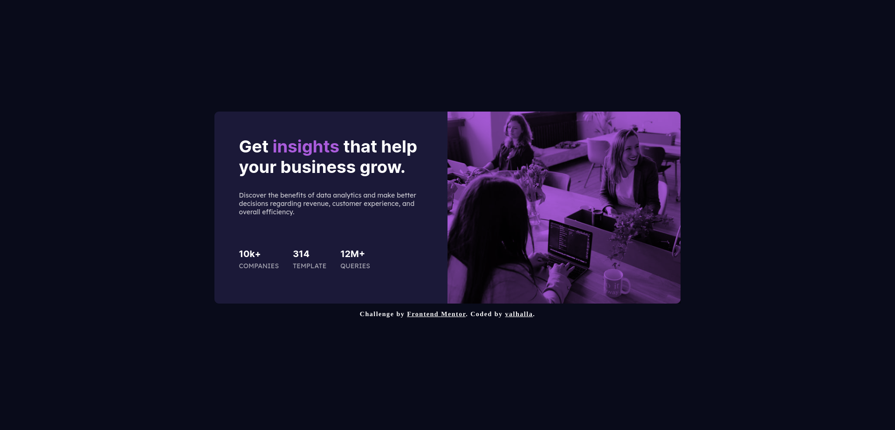

# Frontend Mentor - Stats preview card component solution

This is a solution to the [Stats preview card component challenge on Frontend Mentor](https://www.frontendmentor.io/challenges/stats-preview-card-component-8JqbgoU62). Frontend Mentor challenges help you improve your coding skills by building realistic projects.

## Table of contents

- [Overview](#overview)
  - [The challenge](#the-challenge)
  - [Screenshot](#screenshot)
  - [Links](#links)
- [My process](#my-process)
  - [Built with](#built-with)
  - [What I learned](#what-i-learned)
  - [Continued development](#continued-development)
  - [Useful resources](#useful-resources)
- [Author](#author)


## Overview

### The challenge

Users should be able to:

- View the optimal layout depending on their device's screen size

### Screenshot




### Links

- Solution URL: [here](https://github.com/Valhalla-2/stats-preview-card)
- Live Site URL: [here](https://stats-preview-card-to-frontend.netlify.app/)

## My process

### Built with

- Semantic HTML5 markup
- CSS custom properties
- Flexbox
- Mobile-first workflow


### What I learned

I learned about [clamp()](https://developer.mozilla.org/en-US/docs/Web/CSS/clamp) function & mix-blend-mode by completing this project .
To see how you can add code snippets, see below:

```html
<picture class="">
        <source media="(min-width:580px)" srcset="images/image-header-desktop.jpg" type="image/jpg" class="programming-workplace programming-workplace-desktop">
        
       </picture>
```
```css
.programming-workplace-mobile {
  display: block;
  width: 100%;
  height: 100%;
  object-fit: cover;
  mix-blend-mode: multiply;
}
```

### Continued development

Make the design look even more cooler and try to achieve the design with less code

### Useful resources

- [Resource 1](https://github.com/indraAK/stats-preview-card-component) - By reading his code i learnt about mix-blend-mode , that helped me to change the image color .
- [Resource 2](https://developer.mozilla.org/en-US/docs/Web/CSS/clamp) - This is an amazing article which helped me finally understand clamp() function. I'd recommend it to anyone still learning this concept.

## Author

- Frontend Mentor - [@valhalla-2](https://www.frontendmentor.io/profile/Valhalla-2)
- Github - [@valhalla-2](https://github.com/Valhalla-2)

